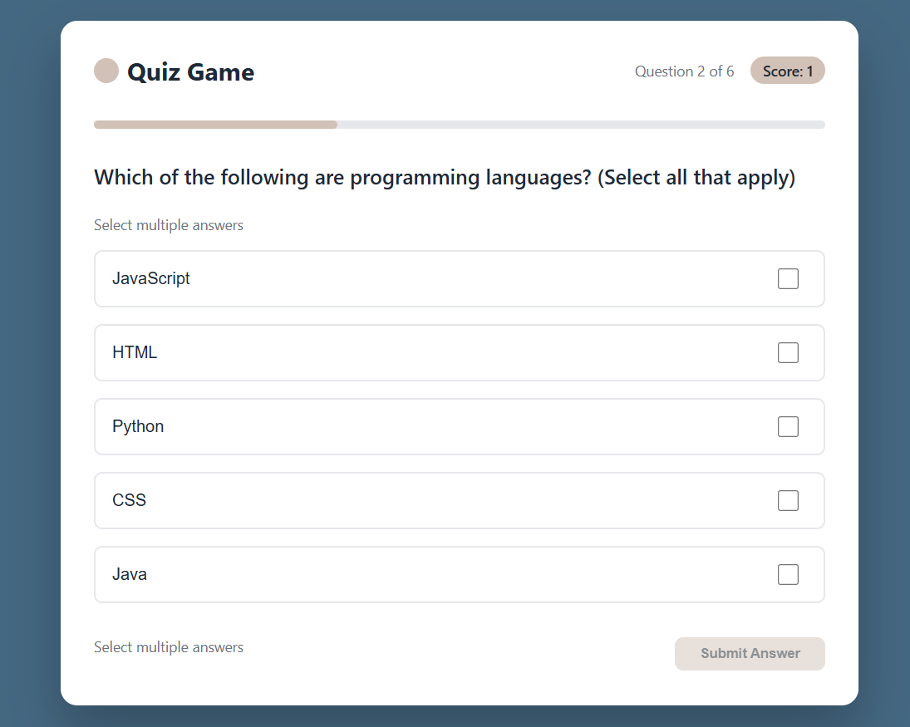

# Quiz Game Application

A modern, interactive web-based quiz game built with HTML, CSS, and JavaScript. Features multiple question types, real-time scoring, and instant feedback with smooth animations and progress tracking.

## 🧠 Quiz Game

A responsive, professional quiz application built using HTML, CSS, and JavaScript.

## ✨ Features

* Multiple question types: Single choice, Multiple choice, Fill-in-the-blank
* Real-time progress tracking and scoring
* Instant answer validation with visual feedback
* Performance-based final results (Excellent/Good/Practice)
* Smooth transitions and hover effects
* Modern blue-beige color scheme (#456882 & #D2C1B6)
* Mobile-friendly responsive design
* Question counter and progress bar
* Restart functionality with score reset

## 📦 Technologies Used

* HTML5
* CSS3 (Flexbox, Transitions, Custom Styling)
* JavaScript (Vanilla)
* DOM Manipulation
* Event Handling
* Array Methods
* Form Validation

## 📸 Preview



## 🚀 How to Use

1. Clone the repo or download ZIP
```
https://github.com/yourusername/quiz-game-application
```

2. Open `index.html` in your browser
3. Read each question carefully
4. Select answers or type in text fields
5. Click "Submit Answer" to validate
6. Navigate through all questions
7. View your final score and performance feedback
8. Use "Take Quiz Again" to restart

## 📁 File Structure

```
quiz-game-application/
├── index.html
├── style.css
├── script.js
└── README.md
```

## 🌐 Browser Support

* Chrome 60+
* Firefox 55+
* Safari 12+
* Edge 79+

## 📄 License

MIT License - feel free to use and modify!
